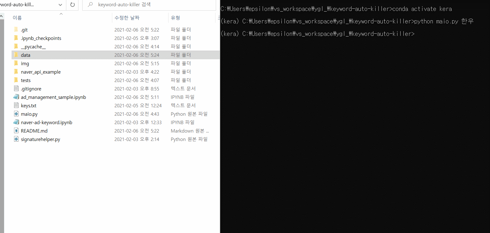
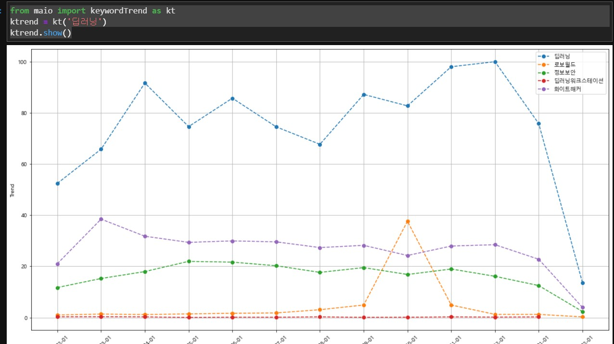

[Youtube Video About simple usage ](https://youtu.be/_kPnSxVV7z0)


## Make your marketing analysis be automatic


- auto keywords generation
- auto inserting to Naver data lab  

-------

### Generating keywords of one keyword you entered  
### Inserting these automaticaly to NAVER DATA LAB !
   

#### USAGE

to get graph image files  

```shell  
python maio.py keyword_You_Wanna_Search  
```  

maio package api

```python  
# show graphs in Ipython or Jupyter env  

from maio import keywordTrend as kt 
ktrend = kt('딥러닝')      
ktrend.show()     
 
ktrend.tkwds # can get related keywords   
ktred.kwds_coordinates() # coordinates of each keywords   
```   



#### ETC

>  ABOUT KEYS   

(FOR Using naver api)
you have to make 'keys.txt' and then

'''    
API_KEY=blablas~  
SECRET_KEY=blasblas~  
CUSTOMER_ID=1316  
'''


> Improvement things

- when fetching data, change amount of data 1000 > 100 (time-consuming)
    - I asked this problem to Naver api group , they said there's not option to change amount of data